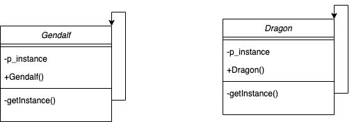

#  LOTR

### 01.05.2020 

Реализованы: 
    - создание unit-ов с помощью порождающих паттернов - Factory Method и Singleton, а также их юнит-тестирование; 
    - создание группы unit-ов с помощью структурных паттернов Composite и Proxy.

##### Сборка и запуск:
- сборка cmake .. && make all
- в /bin лежат executable LOTR и LOTR_tests
- Если указан CMAKE_INSTALL_PREFIX, то в CMAKE_INSTALL_PREFIX лежат исполняемые LOTR и LOTR_tests

##### При push в ветку dev организованы сборка и запуск проекта и запуска юнит-тестирования при помощи GitHub Actions :)

##### Диаграмы классов и связей между ними:

